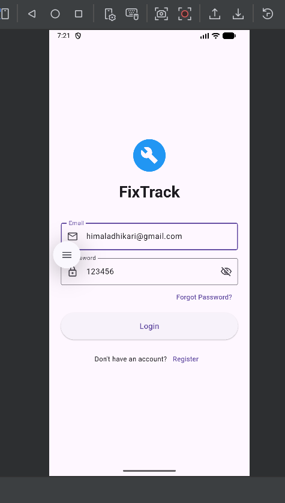
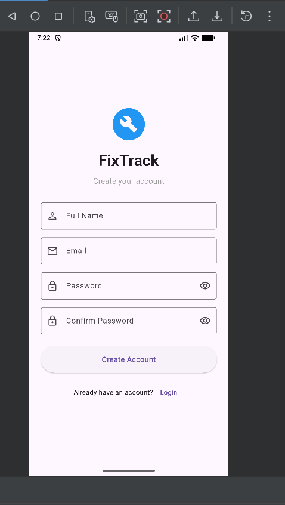
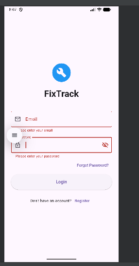
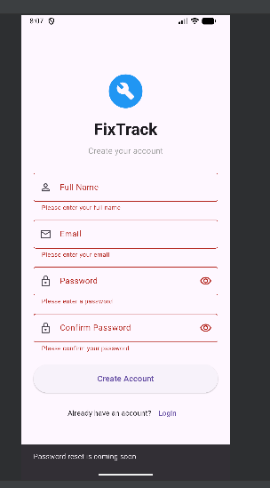

## FixTrack - Login & Registration UI

A Flutter mobile app UI for FixTrack, a planned repair booking and
tracking platform that connects customers with electronic repair shops.
This repository contains the Login and Registration screens.

## Features

- Login screen with app name/logo, email and password fields
- Show/hide password toggle
- "Forgot Password?" option
- Registration screen with full name, email, password, and confirm password
- Form validation (empty fields, valid email format, minimum password
  length, matching passwords)
- Navigation between Login and Registration screens
- Keyboard "Next"/"Done" actions for smoother form filling

## Screenshots

**Login page:**

**Registration page**: 

**Login valodation**:

**Registration validation**:

## Technologies Used

- Flutter
- Dart
- Material Design 3 widgets

## How to Run

1. Install flutter and set
   up an Android emulator or connect a physical device.
2. Clone this repository.
3. Move into the project folder.
4. Install dependencies.
5. Run the app; "flutter run".
